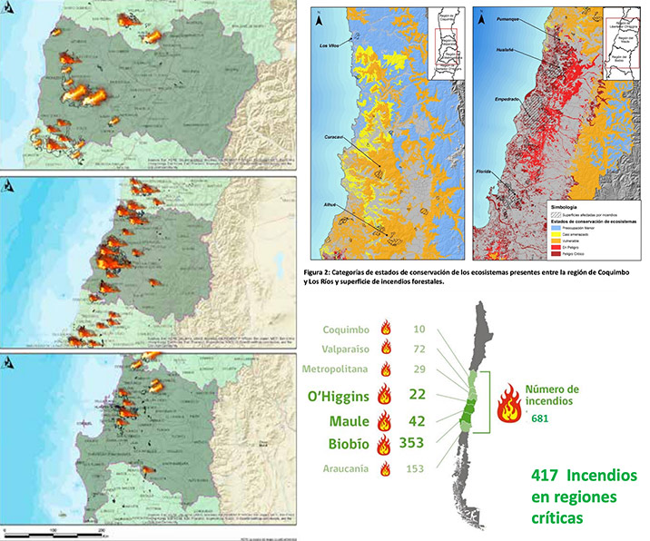
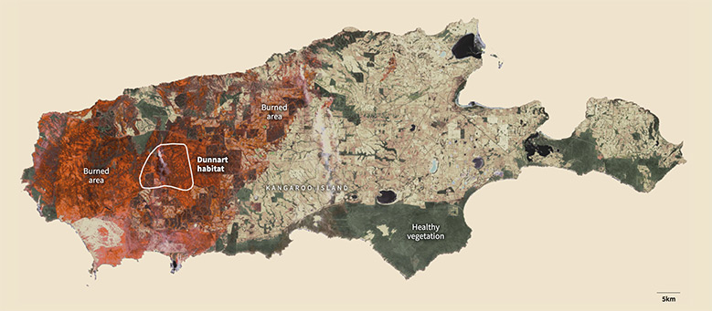

# Tormenta de Fuego, Chile 2017

> [Link página de bocetos](/bocetos/)

## “Mega Incendio ocurrido en enero y febrero de 2017, es la catástrofe forestal más grave de nuestra historia”

### Introducción

A inicios del año 2017, en el secano costero chileno acontecieron una suma de incendios mega forestales que afectaron principalmente siete regiones del país. Este hecho fue denominado por especialistas como una “Tormenta de Fuego”, dada su inusual gravedad que da paso a una nueva generación de incendios a escala mundial, la que según expertos de la Unión Europea tiene como causa principal el calentamiento global.

La situación acontecida en el territorio nacional, se convirtió rápidamente en un episodio de escala mundial, puesto que supera la “quinta generación” de incendios dada su intensidad en la línea de fuego y la velocidad de propagación (UE 2017; CONAF 2017). 

Durante este tiempo, se establecieron más de 500 focos de incendios activos, que sumado a la escasez hídrica, las extensas plantaciones forestales, el aumento de las temperaturas del verano sobre 35 y 40 grados Celsius, y la intensidad de los vientos, se combinaron de modo tal que el fuego adquirió características de incontrolables, lo que da paso a la denominación de este fenómeno como tormenta de fuego.

Rescátamos la línea gráfica presentada en esta ilustración, queremos mostrar un contraste de texturas a través de un efecto acuarela.

### Efectos regionales en uso de suelo:

Si bien se estima que la extensión total de territorios afectados fue cercana a las 500.000 hectáreas, el catastro efectuado por tipos de uso de suelo da cuenta de una cifra de 467.538 hectáreas entre las regiones de Coquimbo y La Araucanía, siendo la región del Maule la más afectada con alrededor de 280.000 hectáreas. Por tipo de uso suelo, el destinado a plantaciones forestales fue el más afectado, también con alrededor de 280.000 hectáreas. 

|   Región  | Bosque Nativo | Matorral y Praderas | Plantaciones | Uso Agrícola |  Otros |  Total  |
|:---------:|:-------------:|:-------------------:|:------------:|:------------:|:------:|:-------:|
| O'Higgins |     34.648    |        10.325       |    34.399    |     8.609    |   146  |  88.127 |
|   Maule   |     29.588    |        51.055       |    185.875   |    12.551    |   862  | 279.931 |
|  Bío-Bío  |     12.894    |        15.177       |    60.280    |    10.357    |   772  |  99.480 |
|   Total   |     77.130    |        76.557       | **280.554**  |    31.517    |  1.780 | 467.538 |
|     %     |      16,5%    |         16,4%       |    **60%**   |      6,7%    |   0,4% |   100%  |

Contexto: Santiago tiene 64.100 hectáreas (lo que se traduce en aproximadamente 7 Santiagos en 18 días).

Acá vemos algunos mapas que muestran las zonas afectadas.

Rescatamos: La calidad del mapa y cómo los colores guían al lector para identificar las zonas afectadas.

Cambiaríamos: Por un mapa de las regiones afectadas, mostraríamos;
1) Las hectáreas afectadas (bosque nativo, plantaciones, matorral, agrícola).
2) Los focos de incendio.

### Efectos por tipo de área

|   Región  | Áreas sin vegetación | Áreas Urbanas-Industriales | Bosques | Humedales |  Praderas y Matorrales | Terrenos Agrícolas |  Total  |
|:---------:|:--------------------:|:--------------------------:|:-------:|:---------:|:----------------------:|:------------------:|:-------:|
| O'Higgins |          15,1        |              132,7         |69.727,3 |     0,4   |        11.484,3        |       8.997,4      |90.357,3 |
|   Maule   |          221,9       |              406,9         |215.465,7|   232,7   |   51.105,2             |      12.673,6      |280.106,0|
|  Bío-Bío  |          319,2       |              173,9         |73.174,6 |   278,7   |   15.176,8             |      10.356,5      |99.479,7 |
|   Total   |        77.130        |              76.557        |**280.554**|31.517   |  1.780                 |       467.538      |518.174,2|
|     %     |        0,1%          |               0,2%         |**75,0%** |   0,1%    |   18,1%                |        6,5%        | 100%    |

Rescatamos: Recalcar el porcentaje de bosques afectados.

### Efectos por región en la flora y la fauna 

La mayor proporción de daño corresponde a plantaciones forestales (80% pino radiata); bosques nativos en su mayoría del tipo esclerófilo, y praderas y matorrales. Con relación a las plantaciones forestales, un 52% de la superficie corresponde a grandes empresas forestales, un 29% a pequeños propietarios forestales, un 16% a medianos propietarios y un 3% a empresas medianas. Como una medida de magnitud, en plantaciones lo quemado corresponde al 8% de la superficie nacional. 

Rescatamos: Los gráficos figurativos de cada especie afectada por el incendio.

Rescatamos: La representación de las especies afectadas en el incendio de Australia asociadas a determinados territorios del país. 

Cambiaríamos: Los tipos de animales por tipos de plantaciones afectadas asociándolo al mapa del territorio nacional. 

El efecto asociado al sector pecuario afectó a 4.696 agricultores, quienes tuvieron pérdidas efectivas por efecto del fuego o se vieron bajo serio riesgo de muerte de sus animales por falta de forraje y alimentación. En términos concretos, esta emergencia involucró a casi 45 mil cabezas de ganado ovino y caprino, 46 mil colmenas de abejas, ocho mil 500 cabezas bovinas y cinco mil 600 equinos. 

|   Región  | N° Agricultores | Bovinos | Equinos | Ovinos y caprinos | Colmenas |
|:---------:|:-------------:|:-------------------:|:------------:|:------------:|:------:|
| O'Higgins |     1.023    |        2.621      |    1.996    |     20.798    |   20.798 |
|   Maule   |     2.117    |        5.319     |    3.523  |    22.439   |   26.183 |
|  Bío-Bío  |     1.556   |        589       |    123    |    1.584    |   750  |
|   Total   |     4.696   |        8.529       | 5.642  |    44.821   |  45.817 |

### Impacto económico de los incendios en los ámbitos de Agricultura, Ganadería, y Foresto-industrial

La valorización económica del daño en el sector silvoagropecuario causado por los incendios entre el 1 de enero y el 2 de febrero de 2017, es de **MM USD 670 [670.000.000]** (Fuente ODEPA). Lo que se distribuye en MM USD 110.7 millones de bosque nativo, MM USD 25 millones de infraestructura, y: Agricultura: MM USD 36, aproximadamente, entre frutales, praderas, cultivos anuales y forrajeras quemadas. El 80% corresponde a praderas y frutales, en proporciones similares (Fuente ODEPA). Ganadería: MM USD 1 entre ganado y colmenas quemadas (Fuente ODEPA). Foresto-industria: MM USD 497 (Fuente ODEPA).

Las estimaciones antes mencionadas hablan  de  un  efecto  acotado  en  el  ámbito  agropecuario,  pero  devastador  en  lo  relacionado con la industria forestal y los ecosistemas de Chile, así como el impacto que  puede  generarse  sobre  el  empleo,  el  ingreso y los niveles de pobreza rural en el secano costero e interior en la zona centro sur de Chile. 

## Referentes

### Referentes Bibliográficas «TORMENTA DE FUEGO» 
+ [CONAF TORMENTA DE FUEGO](https://www.conaf.cl/tormenta_de_fuego-2017/DESCRIPCION-Y-EFECTOS-TORMENTA-DE-FUEGO-18-ENERO-AL-5-FEBRERO-2017.pdf)
+ https://www.cr2.cl/incendios/
Incendios forestales en Chile de 2017 (datos)
+ https://es.wikipedia.org/wiki/Incendios_forestales_en_Chile_de_2017
+ https://www.odepa.gob.cl/wp-content/uploads/2017/12/incendios2017.pdf

### Antecedentes de infografías 
+ https://graphics.reuters.com/BRAZIL-WILDFIRE/0100B25610Q/index.html
+ https://graphics.reuters.com/AUSTRALIA-BUSHFIRES-WILDLIFE/0100B5672VM/index.html
+ https://graphics.reuters.com/AUSTRALIA-BUSHFIRES/0100B30H252/index.html
+ https://graphics.reuters.com/AUSTRALIA-BUSHFIRES-SIZE%20/0100B4QG2FG/index.html
+ https://graphics.reuters.com/AUSTRALIA-BUSHFIRES-SATELLITEIMAGES/0100B4R62H1/index.html
+ https://graphics.reuters.com/AUSTRALIA-BUSHFIRES-SCALE/0100B4VK2PN/index.html
+ https://graphics.reuters.com/AUSTRALIA-BUSHFIRES-SMOK/0100B4W52R7/index.html
+ https://graphics.reuters.com/AUSTRALIA-BUSHFIRES-WILDLIFE/0100B5672VM/index.html
+ https://graphics.reuters.com/CALIFORNIA-WILDFIRES/xegvboxrypq/index.html
+ https://graphics.reuters.com/CALIFORNIA-WILDFIRE/AIRCRAFT/bdwpkzmyyvm/index.html
+ https://graphics.reuters.com/CLIMATE-WILDFIRES/lbvgnrqjepq/+ 
+ https://graphics.reuters.com/USA-WILDFIRES/WINE/bdwpkkmxmpm/index.html
+ https://graphics.reuters.com/USA-WILDFIRE/POLLUTION/xlbpgjgervq/index.html
